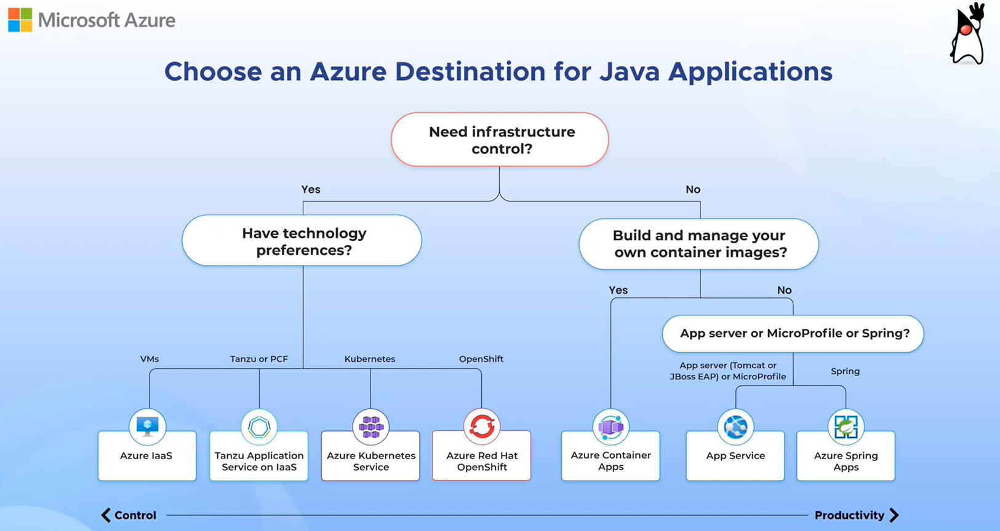

# DevSquad Project: PoC : Java on Azure

This is a collection of sample projects for Cloud Application Developer using Azure Cloud Platform. The sample projects are arranged in different topics about Java Web development and deployment on App Service and Azure Kubernetes Service supported by Secure DevOps Practices.

Scenario: Buid or Migrate Java Web Apps

Reference architecture: Deploy Java Web App to Azure App Service or Azure Kubernetes Service

[Azure Destination for Java Web Apps](https://docs.microsoft.com/en-us/learn/modules/java-target-destinations/)

### Azure Samples
[Java Web App Source Reference](https://github.com/Azure-Samples/containerize-and-deploy-Java-app-to-Azure)

### Check More DevSquad Projects
* [DevSquad Main Project](https://github.com/microsoft/fast-prototyping)

> Note: This page is getting updated so make sure to check regularly for new resources.

## Contributing

This project has adopted the [Microsoft Open Source Code of Conduct](https://opensource.microsoft.com/codeofconduct/). For more information see the [Code of Conduct FAQ](https://opensource.microsoft.com/codeofconduct/faq/) or contact [opencode@microsoft.com](mailto:opencode@microsoft.com) with any additional questions or comments.
